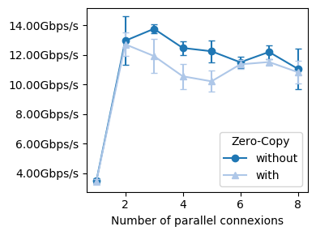
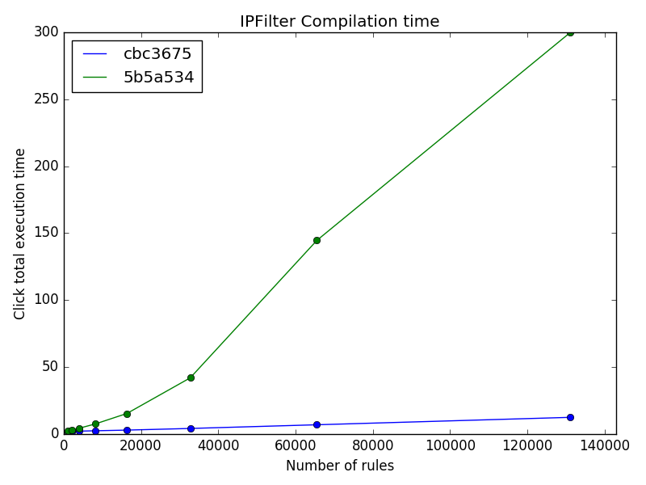
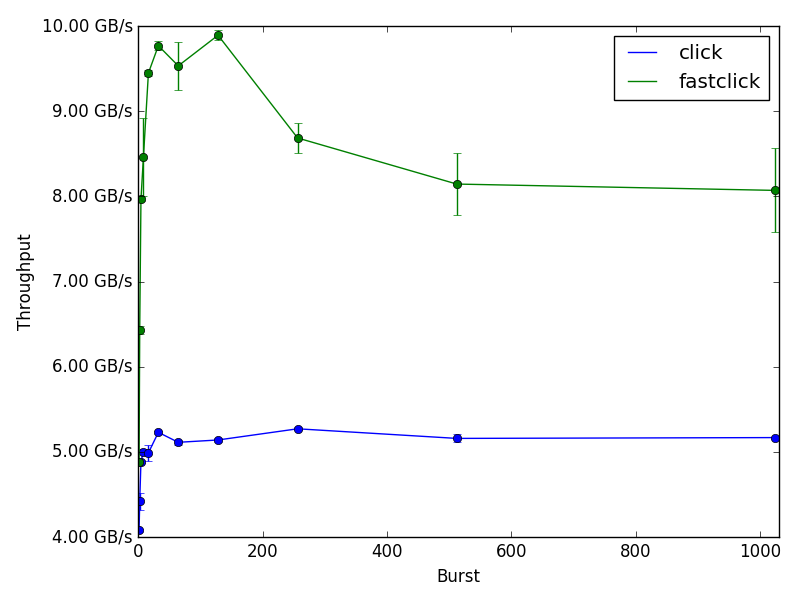
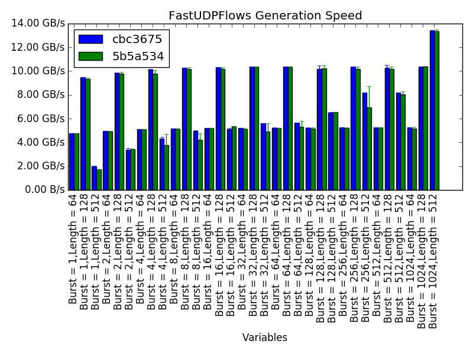
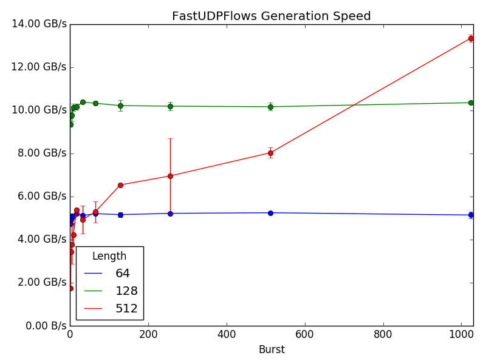

Network Performance Framework
=============================

Run performance tests on network software by running snippets of bash scripts on a cluster
following a simple definition file. For instance, the following configuration to test iPerf3 performance (omitting design options):
```
%variables
PARALLEL=[1-8]
ZEROCOPY={:without,-Z:with}

%script@server
iperf3 -s &> /dev/null

%script@client delay=1
result=$(iperf3 -f k -t 2 -P $PARALLEL $ZEROCOPY -c ${server:0:ip} | tail -n 3 | grep -ioE "[0-9.]+ [kmg]bits")
echo "RESULT $result"
```
Will automatically produce the following graph:



The configuration files, called testies, are much like [Click Modular Router](https://github.com/kohler/click/)'s
testies but with many extended functionalities to run any networking software.

Testie files allow to define a matrix of parameters to try many combinations of
variables for each test and report performance results and evolution for each
line of the matrix.

Finally, a graph will be built and statistical results may be computed for each test 
showing the difference between variables, different softwares, or the evolution of
performances through commits.

Testie files are simple to write, and easy to share, as such we encourage
users to share their testies with their code to allow other users to reproduce
theur performance results, and graphs.

NPF supports running the given test across a custer, allowing to try your tests
in multiple different configuration very quickly and on serious hardware.

### Installation
NPF is built using Python 3, and is published on pypi, so it can be installed
with pip using:

```bash
pip3 install --user npf
```

### Run-time dependencies ###

#### SSH ####
Cluster-based tests use SSH to launch multiple software on different nodes, therefore SSH should be setup on each node for a password-less connection. Use public key authentication and be sure to add the ssh keys in your ssh agent using ssh-add before running NPF.

#### Sudo ####
Most DPDK-based but also other scripts use the "sudo=true" parameter in testies to ask for root access. You can either always connect as root to other servers (see the cluster section below) or set up password-less sudo on all nodes.


#### File-sharing (optional) ####
Server are expected to share the NPF root. Use either a NFS shared mounted on all nodes or sshfs to mount the local NPF folder on all nodes. The path to the shared NPF root can be different on each node, see the cluster section below.
If this is not the case, the dependencies (software built by NPF) will be sent to all nodes that will use them in the corresponding scripts through SSH, but it is slower.

## Tools
Three tools come with this performance framework :
  * npf-run for advance regression and statistics tests on one repository
  * npf-watch to watch one or multiple repositories for any new commit and e-mail regression results in case
of change in performances due to the last commits
  * npf-compare to compare one testie but across multiple repository, mainly to compare
how different branches/implementations behaves against each others

### NPF Run
NPF-Run is the main NPF tool.

It checkouts or updates a given repository (described in the repo
folder), build the software, and launch the given testies

Example :
```bash
    npf-run click --testie tests/click/ #Produce a graph for each click-based tests with the result
```

#### Regression
NPF-Run is able to check commit history, do regression test, and graph the performance history
for all testies using the --regress flag.

```bash
    #click master is updated
    npf-run click --testie tests/click/ --regress #The graph now compares HEAD and the last commit, if major performances changes are found, the return code will be different than 0
    #click master is updated again
    npf-run click --testie tests/click/ --regress #The graph includes the older commit for reference, up to "--graph-num", default is 8
```

Example of a generated graph for the Click Modular Router, just when IPFilter compilation process was re-worked :


Alternatively, you can force npf-run to re-build and compute the data for the old runs directly with the --allow-old-build option :
```bash
    npf-run click --testie tests/click/ --allow-old-build [--graph-num=8] #Graph the performance of the current version and the last 8 previous ones
```

#### Statistics
NPF-Run can produce statistics about the results such as the best set of variable, the average per-variable,
a regression tree and the importance of each features.

```bash
    npf-run click --testie tests/click/ --statistics
```

See *npf-run --help* for more options

### NPF Watcher

Watcher is a stripped down version of npf-run (without statistics support mostly), but allowing to
loop through a given list of repositories watching for changes. When
a new commit is seen, it will run all given testies and e-mail the results
to a given list of addresses.

```bash
npf-watch click fastclick --mail-to tom.barbette@ulg.ac.be --tags fastregression --history 1
```
The arguments are :
 * click fastclick : List of repos to watch, as described in the repos folder
 * --history N allows to re-do the tests for the last N commits, you will receive
 an e-mail for each commits of each repos.
 * --tags TAG1 TAG2 [...] allows to set flags which change variables in the tests, see below.

See *npf-watch --help* for more options

### NPF Compare

NPF-Compare allows to do the contrary of npf-run : instead of
 testing multiple testies on one repository, it tests one testie across
 multiple repositories.
 
This example allows to compare Click against [FastClick](https://github.com/tbarbette/fastclick/) (a faster version of the Click Modular Router) for the infinitesource
  test case :

```bash
npf-compare click fastclick --testie tests/pktgen/infinitesource-01.testie --variables LENGTH=64
```
 * click fastclick : List of repos to compare
 * --testie FILENAME : Testie to test. This argument is available in all tools.
 * --variables  VAR=VAL [...] : Fix the value of one variable.
 By default in this testie, the test is redone with packet length 64,256 and 1024. This
 allows to have one less "dynamic" variables so the grapher can
 use a lineplot instead of a barplot (see below).
 
Result :

Just for relevance, batching is what makes this difference.

This tool has also less options than NPF-Run. You should use NPF-Run
to create your tests and tune parameters for each repository independently.
And then only use npf-compare when ready. Compare does not support statistics or regression tests.

See *npf-compare --help* for more options

### Which one to use
Use npf-run for development, trying big matrices of configuration,
get extended graph and customized tests for each testies.

Use npf-watch with the fastregression tags to send you an e-mail automatically
when some new commits introduce performances problems.

Use npf-compare to compare multiple repositories, multiples branches or multiple
different softwares. The testies included in this repository support comparing throughput of Click and FastClick in diverse
configurations, or NetPerf and Iperf as packet generators.

### Main common arguments
All tools feature those common arguments :

 * --variables VAR=VAL [VAR2=VAL2 ...] allows to overwrite some testie variables configuration, mainly to reduce the set of parameters
 * --config VAR=VAL [VAR2=VAL2 ...] allows to overwrite some configuration options such as n_runs used to define the number of time a test should be launched for each variable combination
 * --testie path : Path to a folder or a testie. By default "tests" is used.


## Dataset
All results of tests are saved per-commit and per-repo to avoid re-computing the next time
you launch either of the tools. However the set of variables must be exactly the
same.

To force re-computing the tests, use the --force-test option. The --force-rebuild
may also be something you want.

### Output

You can customize the output of NFP by passing different arguments. Below, you can find some of the common outputs:

* **pandas [PATH]** NFP produces a Pandas dataframe if you use this argument. Later, you can load the dataframe for post-processing. The following code shows one example for a sample dataframe (i.e., `test-pandas.csv`) with two variables (i.e., `X` and `Y`). Line `3` produces the median of multiple runs, while line `4` shows values of all runs in a list, which can be used for a boxplot.

```python
1 import pandas as pd
2 df = pd.read_csv("test-pandas.csv")
3 df[['X','Y']].groupby('X').agg({'Y' : ['median']})
4 df[['X','Y']].groupby('X').agg({'Y' : lambda x : list(x)})
```

## Tags
All programs have the --tags argument, allowing to give a set of tags
that trigger changes in the testies. The dpdk flags tells that a DPDK
environment is setted up with at least two NICs, allowing DPDK-based
tests to run. The fastregression tag allows to only try important
variable combination and not search for performance points, while full
is the contrary and will run a very big set of variables combinations
to get statistics out of results.


## Writing testie files
See [tests/README.md](tests/README.md) to read more about testies and learn about creating new ones. Testies describe the tests and parameters to re-run them in multiple configuration. Testie are the heart of NPF.

## Repository files
See [repo/README.md](repo/README.md) to lear how to build repository definition files to let NPF know how to fetch and compile some software

## Cluster
Testie files define multiple roles such as "client" or "server". Each role can be mapped
 to a given node to run a test across a cluster using the *--cluster ROLE=NODE [ROLE2=NODE2]* argument.

NPF will run the testie scripts for each role on the mapped cluster. Giving the node address in the
 command line may be enough. However some tests require more information about each node
 that can be set using cluster files. More information about writing cluster files is given in [cluster/README.md](cluster/README.md)

### Graph
Graph are automatically generated for all tested variables
combinations.

To choose the type of graph, the number of dynamic variables is taken into account.

Below, npf-run gave two series to the Grapher (current and last commit), while the testie
generate a matrix of Burst and Lengths, that is 2 dynamic variables and only a barplot can render that correctly
as lines would be uncomparable.



If a "previous version" is not given to npf-run (so it just runs the test for the current master but do not compare 
the results), the graph will use one variable as the serie as having only one
line would be a loss of space, leaving only one dybamic variable :


The Comparator uses the repositories as series.

#### Graphing options
The graph can be tweaked using many options, and the data can also be transformed using multiple tools to better display results. Data transformation will also affect the output CSV. In any case none of these options affect the values in the data cache, so you may try different tweaks without risks.

All the following options can be added to the %config section of the testie, or after the --config parameter on the command line of any of the tools.

This section is in rework.
 * var prefix generally affect variables. It generally takes a list of variables, or a dict of variables->parameters.
 * graph prefix only affect the graph, styling ,etc. The CSV data will not be changed.

##### Graph styling
###### Confidence intervals
 * **graph_error_fill**=true/false Display a "filling zone" instead of error bars. To be used when you have many points and your graph becomes horrible.
###### Line/series style
 * **graph_color**={0,1,2,3} Select a set of color for each serie. Colors are predefined ranges. Default is to use the 0 set of colors for all series, the serie 0 is a mix of different colors, while 1 to 5 are shades of the same colors.
 * **graph_markers**={'o', '^', 's', 'D', '*', 'x', '.', '_', 'H', '>', '<', 'v', 'd'}, type of markers to be used, per-serie. Default if this. See matplotlib docs to find the type.
 * **graph_lines**={'-', '--', '-.', ':'} Type of lines, per-series.
###### Scaling and axis limits
 * **var_log**, []                                     
 * **var_log_base**, {}              
 * **var_lim**, {} 
 * **var_format**={THROUGHPUT:%dGbps} Printf like formating of va And the prefix should be changed.riables. Eg this example will display all visualisation of the value of throughput (eg in the axis) as XGbps. Use in combination to var_divider.
 * **var_ticks**, {}                                     

###### Units and name of variables
 * **var_names**, {"result-LATENCY":"Latency (µs)","result-THROUGHPUT":"Throughput"})
 * **var_unit**, {"result": "bps","result-LATENCY":"us","latency":"us","throughput":"bps"})
  
###### Plot types
 * **graph_scatter**=true/false Use a scatter plot instead of a lineplot, default false. You must arrange the data so it displays as a line plot (one dynamic variable only).
 * **graph_grid**=true/false Display a grid on the graph. Default false.
 * **graph_bar_stacks**=true/false If your series are a complex barplot (more than 1 dynamic variable), it will stack the plots instead of adding them one after the other. Default is false.
###### Series tweaking
 * **graph_series_sort**=method Sort series according to the method wich can be : "natsort", natural alphabetical sorting, "avg", "min" or "max" to sort according "y" values. The sorting can be inversed by prefix the method with "-". Default is to not reorder.
 * **graph_max_series**=N limint the number of series to N, used in conjunction with graph_series_sort to only show the "best" series. By default there is no limit.
 * **graph_serie**=variable Use a specified variable as the serie of a line plot.
###### Information on graphs
 * **graph_legend**=true/false Enable/disable legend. Default is true.
 * **title**=title Title of the graph
 * **var_hide**={A,B,...} List of variables to hide
 

##### Data transformation
 * **var_combine**={NUMA+CORE:SCORE} will combine multiple variables in a single one. Eg if you have a NUMA={0,1} variable, and CORE=[1-4] this will combine them as a single variable SCORE={0-1,0-2,0-3,0-4,1-1,1-2,1-3,1-4}. This allows to reduce the number of variables to graph, eg you may prefer to have a lineplot of SCORE, instead of a barplot of NUMA and CORE according to the serie.
 * **series_as_variables**=true/false Will convert the series as a variable. This is useful in npf-compare to consider the different tags/software you used as a variable, and use something else as a serie.
 * **var_as_series**={QUEUE,POLICY} list of variables to use as series. If multiple, or a serie already exists, it will do the cross product of the variables. Usefull to pass "trailing" dynamic variables as more lines in a lineplot.
 * **result_as_variables**={COUNT-Q(.*):QUEUE-COUNT} Group multiple results matching a regex as a single variable. Eg if you run a single test that outputs multiple statistics for "the same thing", like the number of bytes per NIC queues, you will have your scipt display RESULT-COUNT-Q0 A, RESULT-COUNT-Q1 B,  ... and this example will make a variable QUEUE with all the observed values, and create a new result type called "COUNT".
 * **series_prop**=true/false Divide all results by the results of the first serie. Hence graphs will be a percentage of relative to the first series. Eg if the first serie is "software 1" it will be removed from the graph and the other series will show how much better software 2, ... did against software 1.
 * **var_divider**, {'result':1}) Divide the variables or results by the given value.
 * **graph_map**, 
 * **graph_cross_reference**, {Y:VARIABLE}, change the graph where the Y axis is Y (the result name) to have the X variable being another variable
 
##### Combining graphs (subplots)
 * **graph_subplot_results**={THROUGHPUT+LATENCY:2} combine two results in a single figure. If graph_subplot_type is subplot, then it will simply combine the graphs in a single file using the given number of columns. If the subplot_type is axis, it will use a dual-axis plot. Only the last variable will be on the second axis, so one may combine multiple variables on the same axis, like TX and RX throughput on the left axis, and the latency on the right axis?
 * **graph_display_statics**=true/false Will add a subplot to show the value of static variables. Useful to exchange graphs with colleages knowing what are the fixed parameters for all the graph you show. But the results is somehow horrible.
 * **graph_text**=string Add some texts under all graphs.

### Where to continue from here?
Have you read [tests/README.md](tests/README.md)? Then, inspire yourself from the testie files in tests/click mostly, then write your own!
