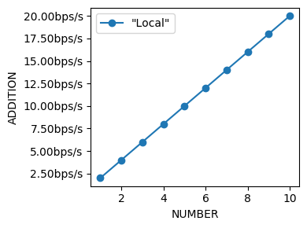
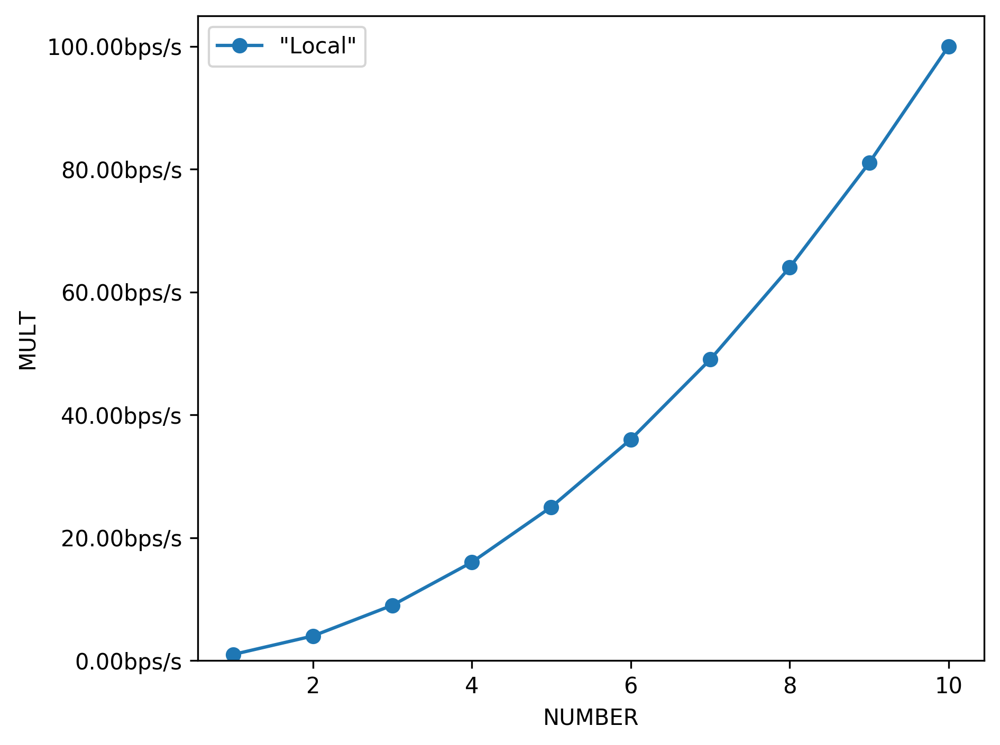

# Writing a *.npf* test script

## Sections

The test script is made of multiple sections, starting with a % like
 "%file CONFIG" which means that a file named CONFIG should be
  created with the content following the section header.

List of sections :
 * info : Information about what the test script does. Usually the first line is the title and will be by default used as the graph title
 * config : Configuration options. See below.
 * variables : List of variables to define the matrix of parameters to try
 * script : Bash commands to execute, the heart of the test. Can be defined to run with a specific role, role are mapped to cluster nodes. See the cluster section below
 * init : Special script that run only once, before all other scripts (therefore, can be fought as an initialization script)
 * import : Import another test script and optionally under a given role. The repository comes with some "modules" test scripts intended for importation. They usually do specific tasks that we don't want to rewrite in all test script such as setting the cpu frequency, IP addresses for some NICs, ...
 * include : A test script to be included inline, not as a sub-test script like import
 * sendfile : Send a file that lies with the test script to the remote machine
 * require : A special script that tells if the test script can run. If any line produce a return code different than 0, the test script will not run
 * pyexit : A python script that will be executed after each tests (but only once after all runs), mainly to change or interpret the results
 
### Script
The script is the heart of NPF. A script section defines a simple list of bash commands to be executed.
```
%script
TOTAL=$(bc 5 + 3)
echo "RESULT $TOTAL"
```
This simple test script will execute locally those two commands, and "collect" the result that is 8. By default a script is re-executed 3 times to observe the variance.

There can be multiple RESULT:

```
%script
ADD=$(bc 5 + 3)
DIFF=$(bc 5 - 3)
echo "RESULT-ADDITION $ADD"
echo "RESULT-DIFFERENCE $DIFF"
```
The result will be collected, and 2 graphs will be produced, showing the value of ADDITION is 8 and the DIFFERENCE is 2.

Finally, scripts can take some parameters and can be required to be executed on a specific machine (roles):
```
%script@client autokill=false delay=5
echo "EVENT finished"

%script@server sudo=true waitfor=finished
echo "RESULT 79"
```
In this example, the first script will be launched on "client" and the second on "server". See [../README.md] to check how to attribute those roles to real machines. The first script will not interrupt the test when it finishes, and will start after a delay of 5 seconds.
The second script will run on "server", with elevated priviledges. But it will run only when the first one has finished and displayed the "finished" event.

### Variables
List of variables that will be replaced in any script or file section (searching for pattern $VARIABLE or ${VARIABLE}).

A variable can describe multiple values to try:
 - LENGTH=60 Single value
 - LENGTH=[60+1024] All values between 60 and 1024, included
 - LENGTH=\[64\*1024\] All values starting from 64 multiplied per 2 up to 1024
 - LENGTH={60,64,128,256,1024,1496} A list of values

```
%variables
NUMBER=[1-10]

%script
ADD=$(echo "$NUMBER + $NUMBER" | bc)
MULT=$(echo "$NUMBER * $NUMBER" | bc)
echo "RESULT-ADDITION $ADD"
echo "RESULT-MULT $MULT"
```
The example above will re-execute the test (script) for all "NUMBER" from 1 to 10. The following graphs will be automatically produced:
. See [the main README](../README.md#graphing-options) to style the graph and change units, axis names, etc...


Variables can optionaly be prefixed with a tag and a colon to be included only
if a tag is given (by the repo, or the command line argument):
 - cpu:CPU={0,1} If the tag cpu is given, $CPU will be expanded by 0 and 1
 - -cpu:CPU=1    If the tag cpu is not given, $CPU will be expanded by 1

This allows to do more extanded tests to grid-search some value, but do not include that in regression test


### Config
List of test configuration option not related to graphing (those ones are described [in the main README](../README.md#graphing-options).
 - acceptable=0.01         Acceptable difference between multiple regression runs
 - n\_runs=1               Number of runs to do of each test
 - unacceptable\_n\_runs=0 Number of runs to do when the value is first rejected (to avoid false positives). Half the most abnormal runs will be rejected to have a most common value average.
 - required\_tags=         Comma-separated list of tags needed to run this run

### pyexit
NPF will extract all results prefixed by *RESULT[-VARNAME]*. If VARNAME is in result_add={...} config list, occurences of the same VARNAME will be added together, if it is in the result_append config_list, results will be append as a list, else the VARNAME will overwrite each others.

To do more, one can use the %pyexit section to interpret the results :
```
%pyexit
import numpy as np
loss=RESULTS["RX"] - RESULTS["TX"]
RESULTS["LOSS"]=loss
```
Any python code will be accepted, so one may compute variance among multiple results, etc. Kind results are available under KIND_RESULTS.

## Constants

Multiple constants can be used in the files and scripts sections:
 - NPF_ROOT : Path to NPF
 - NPF_BUILD_PATH: Path to the build folder of NPF
 - NPF_REPO: Path to the repository under test
 - NPF_test script_PATH: Path to the location of the test script path
 - NPF_RESULT_PATH: Path to the result folder (by default when the command is run, or as passed by the --result-path option)
 - NPF_OUTPUT_PATH: Path to the output folder (by default as result, unless given with --output-filename)
 - NPF_NODE_ID: Index of the node used for the same role, in general 1
 - NPF_NODE_MAX: Number of nodes running the same role, in general 1
 - NPF_MULTI_ID: Index of the script when running multiple times the same script on each node using the "multi" feature, in general 1
 - NPF_MULTI_MAX: Number of multi as given to the cluster config (default is 1)

## test scripts shipped with NPF

### Generic ###
Generic tests are used to do black-box testing, they are L2/L3 generators,
packets trace replay and HTTP generators.

They are generic in the sense that you could use them out of the box to test
any device under test in the middle of a client and a server.

 * generic_dpdk : DPDK-based tests, need a DPDK environment setted up
 * generic : Other tests using the normal OS stack
